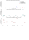

# <a name="MScheck for locating target compound masses in mass spectra"></a>**MScheck for locating target compound masses in mass spectra**

[//]: # "Badges"

[](https://badge.fury.io/py/mscheck)

[](https://github.com/waztom/mscheck/actions/workflows/build-test.yml)

MScheck is a python package that hunts for a target compound mass + given ion mass (eg. H+, Na+).
MScheck was created to assist with the automated mass spectrum analysis of target compounds synthesised using
a high throughput approach.

MSCheck uses the excellent Python library [pyOpenMS](https://pyopenms.readthedocs.io/en/latest/index.html) for reading and handling .mzML mass spectra files. The spectra are stored and handled as a MassSpectrum class object - see [spectrum.py](https://github.com/Waztom/mscheck/blob/master/mscheck/spectrum.py).

The AnalyseSpectum class - see [analyse.py](https://github.com/Waztom/mscheck/blob/master/mscheck/analyse.py) - use Scipy's signal peak finding algorithms (find_peaks and peak_widths) to find peaks and calculate the full width at half maximum height (FWHM) of the peaks found. Mass spectrum data points are analysed in the area of the peak above the FWHM height by searching for the sum of the parent mass of the target molecule and ion. Different ions can be included in the search - see the example below.

# <a name="MScheck installation"></a>**MScheck installation**

MScheck relies on rdkit for generating molecule SVG images and for calculating molecular weights<br>
Installing rdkit using conda works best followed by a pip install of MScheck<br>

1. Create a conda environment with rdkit

   > `conda create -c conda-forge -n MScheck rdkit`

2. Activate the MScheck conda environment created

   > `conda activate MScheck`

3. Pip install MScheck
   > `pip install mscheck`

# <a name="Preparing vendor files"></a>**Preparing vendor files**

MScheck has been tested on using Agilent LCMS files (.D) as the starting file format. One challenge is to convert vendor file formats into
a format with the binary decoded.

1. Convert .D Agilent folder to a .d MassHunter format using Agilent's ChemStation to MassHunter Translator (B.04.00)
2. Convert .d format into .mzML format using [ProteoWizard's](http://proteowizard.sourceforge.net/) MSConvert tool
3. Finally - we have an file format that we can use!
4. In your favourite IDE or Jupyter notebook - a basic example of using MSCheck is provided below:<br>

```
from mscheck.analyse import AnalyseSpectrum

# Create MS scptrum object and find peaks
test = AnalyseSpectrum("<path to .mzML file>", mode="Positive")

# Set SMILES of target to search for
target_SMILES = "CCOC(=O)N1CCN(C(=O)N2CCN(C(=O)c3ccco3)CC2)CC1"

# Analyse test spectrum searching for target SMILES
test.analyse(compoundsmiles=target_SMILES,
             ionstoadd=["[H]", "[Na]", "[K]", "[NH4+]"],
             tolerance=1)

# Create a .svg report - if you do not give a compound_name
# the ending leaf of the file name will be used
test.create_report(compound_name="Test")
```

 <br>

The .svg report will be in a folder called Reports

Example of report output:<br>

<p align="center">

</p>
