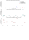

# <a name="MScheck for locating target compound masses in mass spectra"></a>**MScheck for locating target compound masses in mass spectra**

[//]: # "Badges"

[](https://badge.fury.io/py/mscheck)

[](https://github.com/waztom/mscheck/actions/workflows/build-test.yml)

MScheck is a python package that hunts for a target compound mass + given ion mass (eg. H+, Na+).
MScheck was created to assist with the automated mass spectrum analysis of target compounds synthesised using
a high throughput approach.

MSCheck reads .mzML mass spectra files with a small built-in parser (`mscheck/mzml_parser.py`, stdlib + numpy only). The spectra are stored and handled as a MassSpectrum class object - see [mzspectrum.py](https://github.com/Waztom/mscheck/blob/master/mscheck/mzspectrum.py).

The AnalyseSpectum class - see [analyse.py](https://github.com/Waztom/mscheck/blob/master/mscheck/analyse.py) - use Scipy's signal peak finding algorithms (find_peaks and peak_widths) to find peaks and calculate the full width at half maximum height (FWHM) of the peaks found. Mass spectrum data points are analysed in the area of the peak above the FWHM height by searching for the sum of the parent mass of the target molecule and ion. Different ions can be included in the search - see the example below.

# <a name="MScheck installation"></a>**MScheck installation**

MScheck relies on several packages for full functionality including rdkit for molecular operations, plotly for interactive reports, and other scientific computing libraries.<br>
Installing using conda works best for managing dependencies followed by pip installs for MScheck-specific packages.<br>

1. Create a conda environment with required dependencies

   > `conda create -c conda-forge -n MScheck python=3.11 rdkit plotly matplotlib numpy scipy pandas`

2. Activate the MScheck conda environment created

   > `conda activate MScheck`

3. Install additional required packages for enhanced functionality

   > `pip install svgutils numpyencoder`

4. Install MScheck

   > `pip install mscheck`

### Alternative Installation Method

If you prefer to install dependencies individually:

1. Create and activate conda environment:
   ```bash
   conda create -c conda-forge -n MScheck python=3.11
   conda activate MScheck
   ```

2. Install required packages using conda and pip as needed, for example:

   > `conda install -c conda-forge rdkit plotly`

   > `pip install mscheck`

# <a name="Preparing vendor files"></a>**Preparing vendor files**

MScheck has been tested on using Agilent LCMS files (.D) as the starting file format. One challenge is to convert vendor file formats into
a format with the binary decoded.

1. Convert .D Agilent folder to a .d MassHunter format using Agilent's ChemStation to MassHunter Translator (B.04.00)
2. Convert .d format into .mzML format using [ProteoWizard's](http://proteowizard.sourceforge.net/) MSConvert tool
3. Finally - we have an file format that we can use!
4. In your favourite IDE or Jupyter notebook - a basic example of using MSCheck is provided below:<br>

```
from mscheck.analyseMS import AnalyseMS

# Create MS scptrum object and find peaks
test = AnalyseMS("<path to .mzML file>", mode="Positive")

# Set SMILES of target to search for
target_SMILES = "CCOC(=O)N1CCN(C(=O)N2CCN(C(=O)c3ccco3)CC2)CC1"

# Analyse test spectrum searching for target SMILES
test.analyse(compoundsmiles=target_SMILES,
             ionstoadd=["[H]", "[Na]", "[K]", "[NH4+]"],
             tolerance=1)

# Create a .svg report - if you do not give a compound_name
# the ending leaf of the file name will be used
test.create_report(compound_name="Test")
```

 <br>

The .svg report will be in a folder called Reports

For a runnable, end-to-end walkthrough (including bulk analysis with `BulkAnalyser`), see [notebooks/mscheck_tutorial.ipynb](notebooks/mscheck_tutorial.ipynb).

Example of report output:<br>

<p align="center">

</p>
